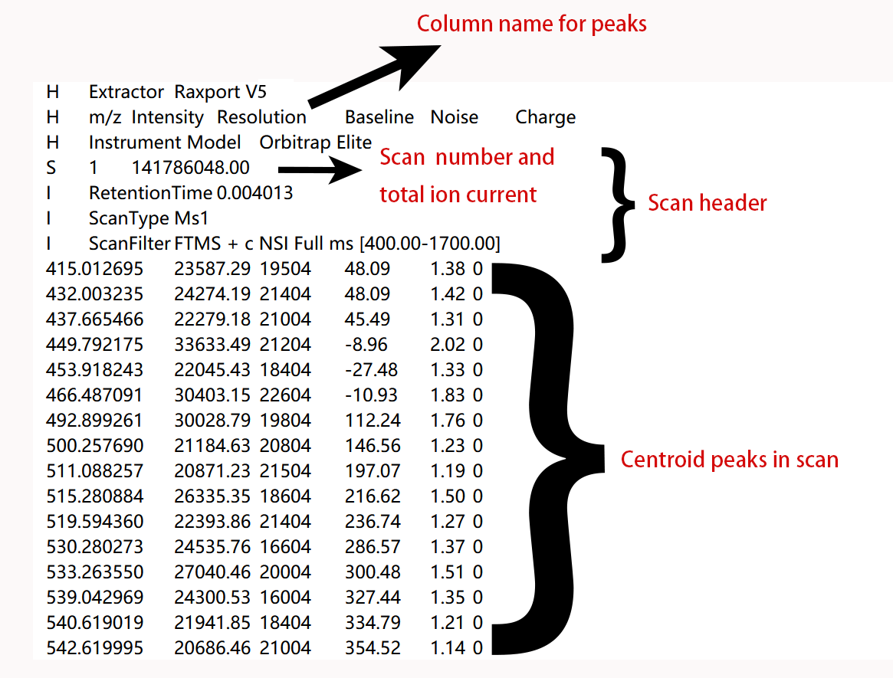
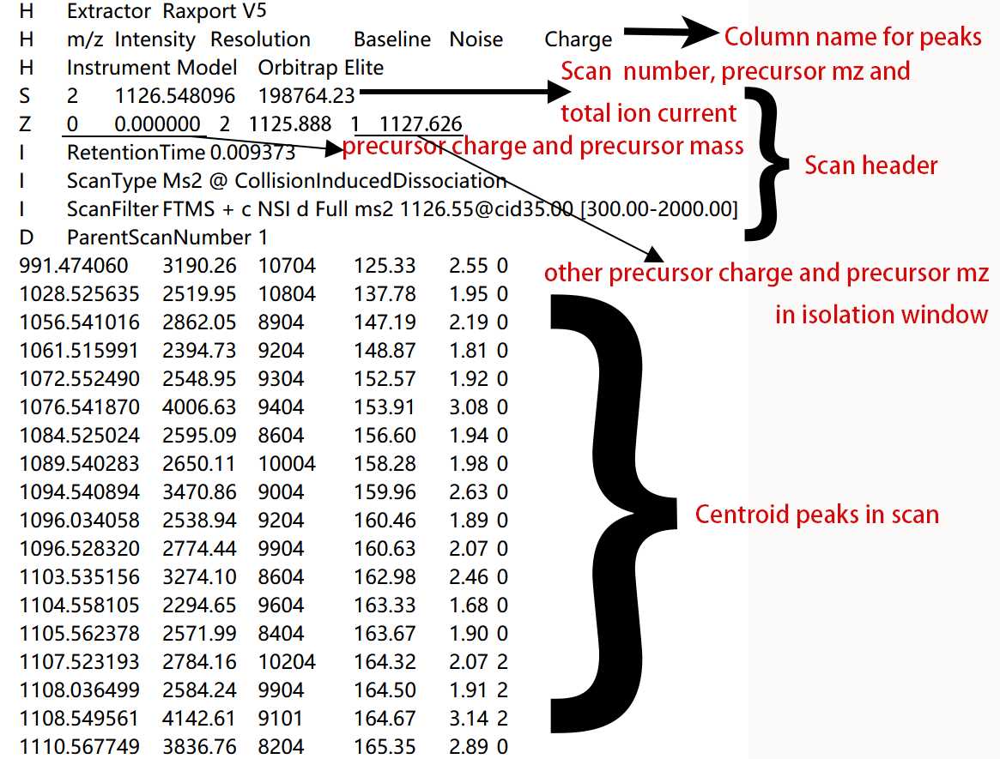

### .Net version of Raxport

Raxport is a simple program which extract scans from raw file generated by mass spectrum from ThermoFisher. It support orbitrap and iontrap scan both. But the generated .FT1 or .FT2 file will have charge information only if the scan is from orbitrap. And we only support MS1 and MS2 scan up to now.

### Run it on Windows

It need a .Net 4.8 environment while win10 and win11 have .Net installed. So, you can run it from terminal or CMD directly. Maybe you need to install .Net 4.8 if using win7.

Download the released .exe file. CD to the file directory and run

```bash
.\Raxport.exe -i 'input path' -o 'output path -j 'threads number'
```

### Run it on Linux or MAC

It need a mono environment on other OS. The simplest way to install mono is by conda. Run following code to install it.

```bash
conda install -c conda-forge mono
```

Download the released .exe file. CD to the file directory and run

```bash
mono Raxport.exe -i 'input path' -o 'output path' -j 'threads number'
```

### Scan in Genrated .FT1 file 

The format of .FT1 is as following picture. All chunks are split by Tab. First "H" line is software information. Second "H" is column name for peaks. Third H is instrument model. Each scan has a scan header and peaks information table. "S" line in scan header is scan number and TIC (total ion current). First "I" is retention time. Second "I" is scan type. Third "I" is scan filter.



### Scan in Genrated .FT2 file

The format of .FT2 is as following picture. All chunks are split by Tab. First "H" line is software information. Second "H" is column name for peaks. Third H is instrument model. Each scan has a scan header and peaks information table. "S" line in scan header is scan number, precursor mz and TIC (total ion current). "Z" line is precursor charge and precursor mass. First "I" is retention time. Second "I" is scan type. Third "I" is scan filter."D" line is the scan number of precursor.



### Compile it in Visual Studio

Raxport.net is developed under .Net 4.8 and relies on ThermoFisher.CommonCore.RawFileReader.dll and ThermoFisher.CommonCore.Data.dll from FreeStyle of ThermoFisher. You can clone this project and compile it in Visual Studio. You may need to install Fody from NuGet to package all .dll files to make the output binary portable.