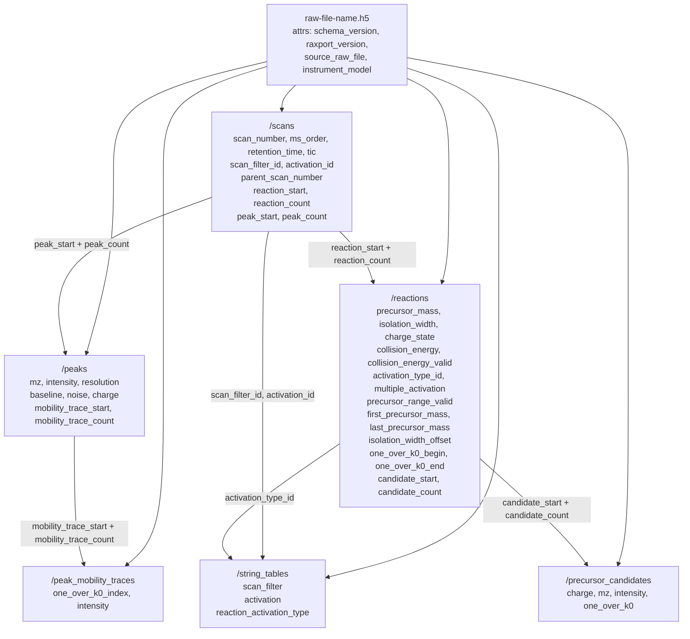

[](https://github.com/xyz1396/Raxport.net/actions/workflows/publish-linux.yml)
[](https://github.com/xyz1396/Raxport.net/actions/workflows/publish-macos.yml)
[](https://github.com/xyz1396/Raxport.net/actions/workflows/publish-windows.yml)

### .NET version of Raxport

Raxport is a simple program which extracts scans from ThermoFisher RAW files and Bruker `.d`/`.d.zip` data. It supports Thermo Orbitrap/IonTrap scans plus Bruker TSF AutoMSMS, TDF PASEF DDA, and TDF DIA inputs, and writes one HDF5 `.h5` file per input. The HDF5 output stores scan metadata, peak arrays, precursor reaction metadata, precursor candidates, and shared string tables in column-oriented datasets.

### Run prebuilt binaries

The release artifacts are self-contained, single-file binaries. Use the file for your platform:

```bash
# Linux x64
./Raxport-linux-x64 -i 'input path' -o 'output path' -j 6 -p 2

# macOS x64
./Raxport-osx-x64 -i 'input path' -o 'output path' -j 6 -p 2

# macOS Apple Silicon
./Raxport-osx-arm64 -i 'input path' -o 'output path' -j 6 -p 2

# Windows x64
.\Raxport-win-x64.exe -i 'input path' -o 'output path' -j 6 -p 2
```

The HDF5 native bridge and SQLite runtime are bundled into the executable and self-extracted by .NET at runtime.

### Build binaries

Raxport targets .NET 8. The project also builds a small native HDF5 bridge from `src/native/raxport_hdf5.c`, so the matching vcpkg HDF5 static package must be installed before publishing. Bruker conversion uses a vcpkg-provided SQLite runtime that is bundled into the single-file publish. The publish must run on the matching OS for the native bridge, unless you prebuild the bridge into `bin/obj/native/<rid>/` first. GitHub Actions install these dependencies automatically.

Run these commands from the repo root to publish self-contained single-file binaries into the top-level `bin/` directory:

```bash
dotnet publish src/RaxportNetCore.csproj /p:PublishProfile=linux-x64-single-file
dotnet publish src/RaxportNetCore.csproj /p:PublishProfile=win-x64-single-file
dotnet publish src/RaxportNetCore.csproj /p:PublishProfile=osx-x64-single-file
dotnet publish src/RaxportNetCore.csproj /p:PublishProfile=osx-arm64-single-file
```

Output files:

- `bin/Raxport-linux-x64`
- `bin/Raxport-win-x64.exe`
- `bin/Raxport-osx-x64`
- `bin/Raxport-osx-arm64`

Each output is intended to be distributed as a single file.

### Command options

Examples:

```bash
# Linux x64: convert all RAW files in a directory, using up to 6 child processes.
./Raxport-linux-x64 -i 'input path' -o 'output path' -j 6 -p 2

# macOS x64.
./Raxport-osx-x64 -i 'input path' -o 'output path' -j 6 -p 2

# macOS Apple Silicon.
./Raxport-osx-arm64 -i 'input path' -o 'output path' -j 6 -p 2

# Windows x64.
.\Raxport-win-x64.exe -i 'input path' -o 'output path' -j 6 -p 2

# Convert one RAW file.
./Raxport-linux-x64 -f 'file.raw' -o 'output path' -p 2

# Convert one Bruker directory or archive.
./Raxport-linux-x64 -f 'sample.d' -o 'output path' -p 2
./Raxport-linux-x64 -f 'sample.d.zip' -o 'output path' -p 2
```

Options:

| Option | Default | Description |
| --- | --- | --- |
| `-i PATH` | current directory | Input directory containing `.raw`, `.d`, or `.d.zip` inputs. |
| `-f FILE` | unset | Convert one RAW file, Bruker `.d` directory, or Bruker `.d.zip` archive instead of scanning the input directory. |
| `-o PATH` | input/current directory | Output directory for generated `.h5` files. |
| `-j N` | `6` | Maximum child Raxport processes when converting multiple RAW files. |
| `-p N` | `2` | HDF5 peak flush units. One unit is 10,000,000 peak rows, so `-p 2` flushes at about 20,000,000 buffered peak rows. |
| `-n N` | `15` | Maximum precursor candidates stored for each MSn scan. |
| `--mz-tolerance-ppm PPM` | `10` | Precursor m/z matching tolerance in ppm. |
| `-m` | off | Merge adjacent MS1 scans. |
| `-h` | off | Print command help and exit. |

Each input produces one `.h5` output file. Bruker archive names strip `.zip` and `.d`, so `sample.d.zip` produces `sample.h5`.

### Generated HDF5 file structure

Each output file uses HDF5 schema version 5. The root object has these attributes:

- `schema_version`: integer schema version, currently `5`
- `raxport_version`: Raxport version that generated the file
- `source_raw_file`: original RAW file path
- `instrument_model`: ThermoFisher instrument model

Datasets are one-dimensional, appendable, chunked, shuffled, and deflate-compressed. Related datasets in the same group have the same row count and are read by matching row index.


```mermaid
flowchart TD
    root["raw-file-name.h5<br/>attrs: schema_version, raxport_version,<br/>source_raw_file, instrument_model"]

    root --> scans["/scans<br/>scan_number, ms_order, retention_time, tic<br/>scan_filter_id, activation_id<br/>parent_scan_number<br/>reaction_start, reaction_count<br/>peak_start, peak_count"]
    root --> peaks["/peaks<br/>mz, intensity, resolution<br/>baseline, noise, charge<br/>mobility_trace_start, mobility_trace_count"]
    root --> traces["/peak_mobility_traces<br/>one_over_k0_index, intensity"]
    root --> reactions["/reactions<br/>precursor_mass, isolation_width, charge_state<br/>collision_energy, collision_energy_valid<br/>activation_type_id, multiple_activation<br/>precursor_range_valid<br/>first_precursor_mass, last_precursor_mass<br/>isolation_width_offset<br/>one_over_k0_begin, one_over_k0_end<br/>candidate_start, candidate_count"]
    root --> candidates["/precursor_candidates<br/>charge, mz, intensity, one_over_k0"]
    root --> strings["/string_tables<br/>scan_filter<br/>activation<br/>reaction_activation_type"]

    scans -- "peak_start + peak_count" --> peaks
    peaks -- "mobility_trace_start + mobility_trace_count" --> traces
    scans -- "reaction_start + reaction_count" --> reactions
    reactions -- "candidate_start + candidate_count" --> candidates
    scans -- "scan_filter_id, activation_id" --> strings
    reactions -- "activation_type_id" --> strings
```

The `/scans` group contains one row per MS scan. For each scan, `peak_start` and `peak_count` select that scan's peak rows from `/peaks`. MS1 scans have `parent_scan_number = 0`, `reaction_start = -1`, and `reaction_count = 0`. MSn scans store the parent precursor scan number and point to one row in `/reactions`.

The `/peaks` group stores centroid or segmented peak arrays. Centroid peaks include `resolution`, `baseline`, `noise`, and `charge`; segmented peaks use `0` for fields not available from the segmented stream. Bruker TDF MS1 peaks keep the collapsed v3 m/z and area in `/peaks`, while `mobility_trace_start` and `mobility_trace_count` point to mobility-resolved evidence in `/peak_mobility_traces`. Peaks without mobility traces use `mobility_trace_start = -1` and `mobility_trace_count = 0`.

The `/peak_mobility_traces` group stores flat parallel `one_over_k0_index` and `intensity` arrays for Bruker TDF MS1 peaks. Trace intensities come from `tims_read_scans_v2` peaks matched to the collapsed centroid m/z using `--mz-tolerance-ppm`.

The `/reactions` group stores precursor and activation metadata for MSn scans. `candidate_start` and `candidate_count` select rows from `/precursor_candidates`, which stores the expanded precursor charge, m/z, candidate intensity, and strongest in-window 1/K0 candidate when available. String-valued fields are normalized through `/string_tables`: scan filters, scan activations, and reaction activation types are stored once and referenced by integer IDs.

### Project dependencies

Raxport.net is developed under .NET 8.

Managed dependencies are stored in `dll/`. The ThermoFisher DLLs come from [RawFileReader](https://github.com/thermofisherlsms/RawFileReader).

Native build dependency:

- HDF5 from vcpkg, statically linked into the Raxport HDF5 bridge.
- SQLite from vcpkg dynamic triplets, bundled into the single-file publish as `libsqlite3.so`, `libsqlite3.dylib`, or `sqlite3.dll`.
- Bruker timsdata runtime libraries under `tims/` for Linux x64 and Windows x64 Bruker conversion. macOS builds remain single-file, but Bruker conversion requires adding a macOS timsdata library.

For local builds, install the vcpkg triplets for your target platform, then run the matching `dotnet publish` command above. The SQLite triplets are `x64-linux-dynamic`, `x64-osx-dynamic`, `arm64-osx-dynamic`, and `x64-windows`. See [test/note.md](./test/note.md) for additional notes.
